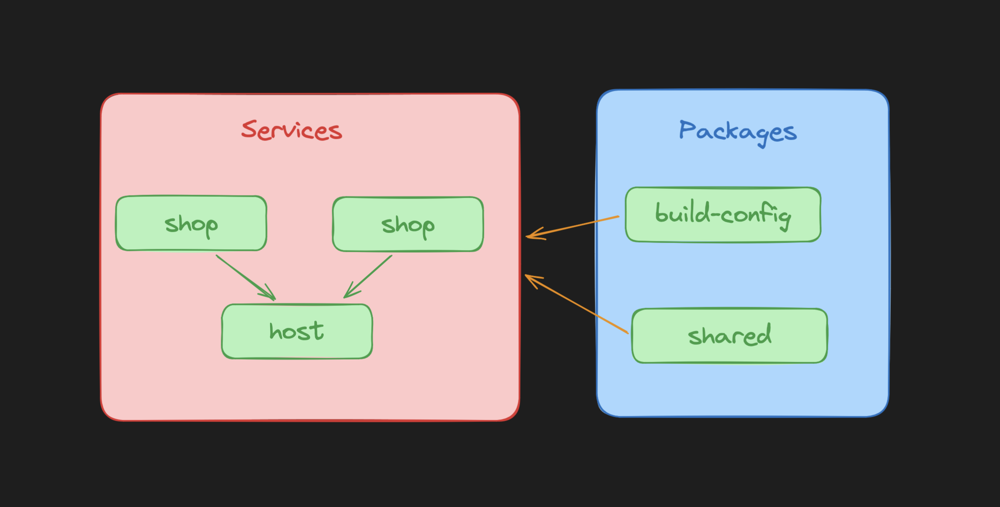

# Проект с настройкой Webpack для React (Module Federation)
- Пример с простым SPA приложением в ветке react-spa-config

Этот проект содержит конфигурацию Webpack с использованием следующих плагинов и лоадеров:

## Плагины:
- ***ModuleFederationPlugin:*** Плагин для создания микрофронтов и управления удаленными зависимостями.
- ***@pmmmwh/react-refresh-webpack-plugin:*** Обеспечивает горячую перезагрузку (hot reload) для React-компонентов во
  время разработки.
- ***@svgr/webpack:*** Позволяет использовать SVG-файлы в React-приложениях как компоненты.
- ***copy-webpack-plugin:*** Копирует файлы или каталоги во время сборки проекта.
- ***html-webpack-plugin:*** Создает HTML-файл для вашего приложения на основе шаблона HTML и автоматически вставляет в
  него ссылки на сгенерированные бандлы JavaScript.
- ***mini-css-extract-plugin:*** Извлекает CSS из JavaScript-бандлов в отдельные файлы CSS для оптимизации загрузки
  страницы.
- ***webpack-bundle-analyzer:*** Предоставляет визуализацию размера и состава бандлов Webpack.

## Лоадеры

- ***babel-loader:*** Транспилирует JavaScript-файлы с использованием Babel.
- ***css-loader:*** Загружает CSS-файлы и разрешает им импортировать другие CSS-файлы и ресурсы, такие как изображения и
  шрифты.
- ***sass-loader:*** Трансформирует SASS/SCSS в CSS.
- ***style-loader:*** Вставляет CSS в DOM через тег `<style>`.
- ***ts-loader:*** Транспилирует TypeScript в JavaScript.
- ***fork-ts-checker-webpack-plugin:*** Позволяет запускать TypeScript type checking в отдельном процессе для ускорения
  сборки.

## Скрипты

- `start` Параллельно запускает все микрофронты (так же позволяет запустить микрофронт отдельно см в [package.json](./package.json))
Без переменных хостовое приложение по умолчанию работает по адресу http://localhost:3000/ (3000 порт)
- `build` Параллельно собирает все микрофронты (так же позволяет собрать микрофронт отдельно см в [package.json](./package.json))
- `lint:types` Параллельно проверяет типы для всех микрофронтов и общих модулей. 

P.S: так же есть возможность запускать скрипт для отдельного микрофронта см. в [package.json](./package.json)

## Установка

1. Клонируйте репозиторий

```shell
git clone https://github.com/ruslan4432013/webpack-react.git
```

2. Перейдите в проект

```shell
cd webpack-react
```

3. Выберите ветку с настроенными микрофронтами

```shell
git checkout react-module-federation-config
```

4. Установить зависимости

```shell
npm install
```

## Использование

Смотрите раздел "Скрипты" для подробной информации о запуске и сборке проекта.


Конфигурационный файл написан на typescript, базовая конфигурация webpack находится по адресу `./packages/build-config/src`

### Объявление env-переменных, доступных в сборке

При необходимости в добавлении env-переменных необходимо их объявить в `config/build/plugins.build.ts` по примеру:

```typescript
new DefinePlugin({
  __PLATFORM__: JSON.stringify(platform),
  __ENV__: JSON.stringify(mode),
  // Ваши переменные
})
```

Использование в коде: 
```typescript jsx
export const App = () => {
  
  if (__ENV__ === 'development') {
    return <DevelopmentView/>
  }

  return <ProductionView/>
}
```

### Архитектура микрофронтов


#### PACKAGES (общие пакеты, доступные в каждом сервисе)

- **build-config** - Общие функции для конфигурации Webpack
- **shared** - Общий переиспользуемый код (ui/lib/routes/и другой код, который необходим в микрофронтовых приложениях) 

#### SERVICES (сами микрофронтенды)

- **host** - Хостовая приложение, в котором собираются все микрофронты
- **shop** - Микрофронтенд с основным приложением (магазин)
- **admin** - Микрофронтенд с админкой 
